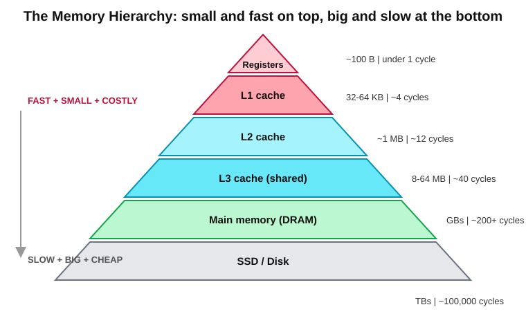
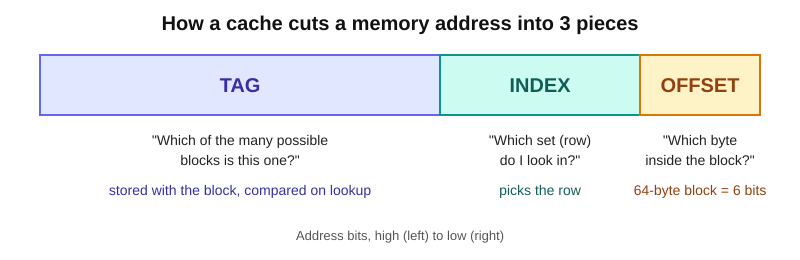
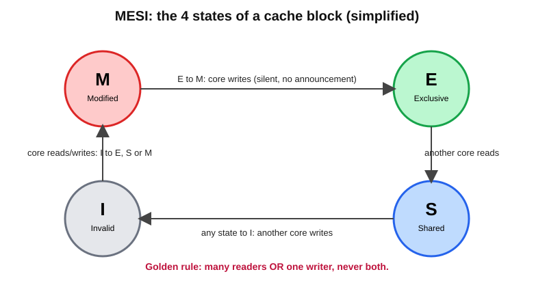
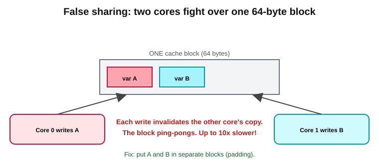

# Caches & Coherence — Explained Simply

> Based on **Deck 4 of µArch Lab**. This guide explains how computers hide slow memory using caches, and how many CPU cores keep their copies of data in agreement.

**Prerequisite idea (the "memory wall"):** a CPU can do work far faster than main memory can supply data. Everything below is about working around that gap.

---

## Table of Contents
1. [Why caches work](#1-why-caches-work)
2. [How a cache finds things](#2-how-a-cache-finds-things)
3. [Why misses happen (the three Cs)](#3-why-misses-happen-the-three-cs)
4. [Average Memory Access Time (AMAT)](#4-average-memory-access-time-amat)
5. [Writes and other tricks](#5-writes-and-other-tricks)
6. [Virtual memory and the TLB](#6-virtual-memory-and-the-tlb)
7. [Coherence: many cores, one truth](#7-coherence-many-cores-one-truth)
8. [Consistency: the order of everything](#8-consistency-the-order-of-everything)
9. [Check yourself](#9-check-yourself)
10. [Cheat sheet](#10-cheat-sheet)

---

## 1. Why caches work

### The analogy
A student writing an essay keeps:
- the **3 books in use** open on the **desk** (fastest),
- a dozen more on the **shelf**,
- the rest at the city **library**,
- anything else at a national **warehouse** (slowest).

Almost every look-up is answered by the desk. That's a cache.

### Definitions
- **Cache**: a small, fast memory holding copies of recently used data close to the processor.
- **Cache hit**: the data is there. Fast.
- **Cache miss**: it isn't, so the request goes one level down. Slow.
- Caches are *invisible* to programs: they never change an answer, only how long it takes.

### The memory hierarchy



| Level | Size | Time |
|---|---|---|
| Registers | ~100 B | < 1 cycle |
| L1 | 32–64 KB | ~4 cycles |
| L2 | ~1 MB | ~12 cycles |
| L3 | 8–64 MB | ~40 cycles |
| DRAM | GBs | ~200+ cycles |
| SSD | TBs | ~100,000 cycles |

Fast memory is small and costly; big memory is slow and cheap. So we **stack** them.

### Why it works: locality
Programs behave predictably, in two ways:

| Type | Meaning | Example | What the cache does |
|---|---|---|---|
| **Temporal locality** | Used now → likely used again soon | loop counter, top of stack | keep recently used data |
| **Spatial locality** | Used address A → nearby addresses likely used | walking through an array | fetch a whole neighbourhood at once |

That neighbourhood is a **cache line** (block): the unit a cache moves and stores, typically **64 bytes**.

---

## 2. How a cache finds things

Every address is cut into three pieces:



- **Offset**: which byte *inside* the block (64-byte block → 6 bits).
- **Index**: which *set* (row) of the cache to look in.
- **Tag**: the rest. Stored with the block and compared to confirm "yes, this is the block I wanted."

### Where may a block live?

| Type | Rule | Pros / Cons |
|---|---|---|
| **Direct-mapped** | exactly **one** place | simple, fast; blocks fight over the same spot |
| **Set-associative** (N-way) | any of **N** places in its set | good compromise; the usual choice |
| **Fully associative** | **anywhere** | no collisions, but every tag is checked; only for tiny caches |

**Parking analogy:** an assigned bay (direct-mapped), any bay on your floor (set-associative), any bay in the building (fully associative).

When a set is full, one block must be evicted. **LRU** (least recently used) evicts the one untouched for longest.

### Mini example
A tiny cache of 4 blocks, reading an array twice: the first pass **misses** every block (first touch); the second pass **hits** every time. With bigger blocks (8 bytes), one miss brings in neighbours too, so misses halve. That's spatial locality in action.

---

## 3. Why misses happen (the three Cs)

| Kind | Cause | Cure |
|---|---|---|
| **Compulsory** (cold) | first touch of a block | bigger blocks, prefetching |
| **Capacity** | working data doesn't fit | bigger cache |
| **Conflict** | too many busy blocks map to the same set while the cache has room elsewhere | more associativity |

A **conflict miss** is one a fully associative cache of the same size would have avoided. (Multicore adds a 4th C: **coherence** misses, covered later.)

### Examples
- **Conflict:** addresses 0 and 16 map to the same set in a direct-mapped cache and keep evicting each other. A 2-way cache fixes it: after 2 misses, all hits.
- **Capacity:** 5 blocks cycle through a 4-block cache with LRU. Each block is evicted *just before* it's needed again, so everything misses. Only a bigger cache helps.

### Every knob has a price

| Turn up… | Compulsory | Capacity | Conflict | Price |
|---|---|---|---|---|
| Cache size | — | fewer | fewer | slower hits, more area/power |
| Associativity | — | — | many fewer | slower hits (more tags to compare) |
| Block size | fewer | can rise | can rise | each miss fetches more bytes |

64 bytes is the near-universal sweet spot for block size.

---

## 4. Average Memory Access Time (AMAT)

```
AMAT = hit time + miss rate × miss penalty
```

### One level
L1 hit = 1 cycle, miss rate = 4%, DRAM = 200 cycles:

```
AMAT = 1 + 0.04 × 200 = 1 + 8 = 9 cycles
```

The 4% that miss cost 8× more than the 96% that hit.

### Several levels
The miss penalty of one level is the *AMAT of the next*:

```
AMAT = hitL1 + missL1 × (hitL2 + missL2 × (hitL3 + missL3 × DRAM))
```

Example (L1: 1 cycle, 5% miss · L2: 12, 40% · L3: 40, 50% · DRAM: 200):

```
L3 level:  40 + 0.50 × 200 = 140
L2 level:  12 + 0.40 × 140 =  68
L1 level:   1 + 0.05 ×  68 = 4.4 cycles
```

**4.4 cycles instead of 9.** Note: these are **local** miss rates (misses ÷ accesses *reaching* that level). Mixing local and global rates is a classic mistake.

### How levels are arranged
- **L1 is split** into instruction + data caches.
- **L2/L3 are unified** (instructions and data together).
- **Private vs shared:** each core usually has its own L1/L2; all cores share the last level.
- **Inclusive** caches keep a copy of L1 contents in the lower level (simpler); **exclusive** caches keep each block in one level only (more total capacity).

---

## 5. Writes and other tricks

### What happens on a store?
| Policy | Behaviour |
|---|---|
| **Write-through** | updates cache **and** next level every time. Simple, lots of traffic |
| **Write-back** | updates only the cache, marks block **dirty**, writes down on eviction. Less traffic, the norm |

- On a store **miss**: *write-allocate* fetches the block first (typical with write-back); *no-write-allocate* writes straight through.
- A **write buffer** lets the core move on without waiting for stores to reach memory.

### Three helpers
- **Victim cache**: tiny store for recently evicted blocks; catches conflict misses cheaply.
- **Prefetching**: fetch blocks *before* they're asked for (too eager = cache pollution).
- **Non-blocking cache**: keeps serving hits while misses are pending; tracks several misses at once. Essential for out-of-order cores.

---

## 6. Virtual memory and the TLB

Programs use **virtual addresses**; hardware translates them to **physical addresses**. Translation works in **pages** (commonly 4 KiB) using a **page table**.

**Why?** Isolation (programs can't see each other), freedom of placement, and the ability to push rarely used pages to disk.

**Analogy:** "Flat 1" exists in two buildings. The postal service knows which street each building is on.

### The TLB
Page tables are multi-level (e.g. RISC-V Sv39 uses 3 levels = **3 extra memory reads** per access!). Far too slow, so we use the **TLB** (Translation Lookaside Buffer): a small, fast cache of recent translations.
- TLB hit → ~1 cycle.
- TLB miss → walk the page table.

**Neat trick:** L1 caches can be looked up *while* the TLB translates, using address bits translation doesn't change. That's why many L1s are **32 KiB, 8-way**: 32 KiB ÷ 8 = 4 KiB = exactly one page.

---

## 7. Coherence: many cores, one truth

### The problem
Two cores both cache `X = 5`. Core 0 writes `X = 9` in its own cache. Core 1 still reads **5** (stale!).

**Cache coherence** = hardware guarantee that, for each location, all cores see the latest write, and see writes in the same order.

### Two ways to keep watch
| Method | How | Trade-off |
|---|---|---|
| **Snooping** | every cache listens on shared wires; writes are announced to all | simple, quick, but doesn't scale past ~a dozen cores |
| **Directory** | a central record says which cores hold each block; messages go only to them | scales to many cores, costs storage |

*Snooping = shouting across an open office. Directory = a receptionist who knows whom to phone.*

### The MESI protocol



| State | Meaning | Matches memory? | Others may hold it? |
|---|---|---|---|
| **M**odified | only copy, changed | no (memory stale) | no |
| **E**xclusive | only copy, unchanged | yes | no |
| **S**hared | read-only copy | yes | yes |
| **I**nvalid | unusable | — | — |

**Golden rule: many readers, or one writer, never both.** To write, a core must first make every other copy Invalid.

**Why "E" exists:** a core reading data nobody else has can later write it with **no announcement**. Great for private data.

**Try this script:** Core 0 reads → Core 1 reads → Core 1 writes → Core 0 reads.
1. Core 0 reads: Core 0 = **E**.
2. Core 1 reads: both = **S**.
3. Core 1 writes: Core 1 = **M**, Core 0 = **I**, memory is stale.
4. Core 0 reads: Core 1 supplies data + writes back; both = **S**.

### A trap: false sharing



Coherence works on whole 64-byte blocks. If core 0 updates `A` and core 1 updates `B`, and both sit in the **same block**, every write invalidates the other's copy. No data is truly shared, yet performance can drop **10× or more**. **Fix:** place such variables in separate blocks.

---

## 8. Consistency: the order of everything

**Coherence** = agreement about **one** location.
**Consistency** = the order in which writes to **different** locations appear to others.

| Model | Rule | Used by |
|---|---|---|
| **Sequential consistency** | as if cores take turns in program order; intuitive but forbids many speed tricks | no mainstream fast CPU |
| **TSO** (total store order) | a load may overtake an earlier store to a different address (stores wait in a buffer) | x86, SPARC |
| **Weak / relaxed** | almost any independent pair may be reordered | Arm, RISC-V (RVWMO), Power |

### Why it matters
```
Core 0          Core 1
A = 1           B = 1
r0 = B          r1 = A
```
Both start at 0. Under sequential consistency, at least one of r0/r1 is 1. With store buffers (TSO), both stores may still be waiting, so **r0 = r1 = 0 is possible**.

### Fences
A **fence** (memory barrier) forces earlier memory operations to finish before later ones start.

```
x86     MFENCE
Arm     DMB
RISC-V  FENCE rw,rw
```

Languages wrap these in "atomics", but locks and flags rely on them.

> ⚠️ **Misconception:** "Coherence and consistency are the same." No. A perfectly coherent machine can still show writes to X and Y out of order. Fences fix *ordering*; they don't make caches coherent (they already are).

### Bigger systems
- **NUMA**: in big servers each chip owns part of memory; its own part is fast, others slower. Place data near the core using it.
- **Roofline**: plot speed vs. "calculations per byte fetched". Little work per byte → you hit the slanted **memory roof**; lots → the flat **compute roof**. It's the memory wall drawn as a line.

---

## 9. Check yourself

1. L1 hit = 2 cycles, miss rate 10%, penalty 100 cycles. AMAT?
2. Two blocks keep evicting each other in a mostly empty direct-mapped cache. Which miss type, and the fix?
3. Core 2 holds X in state M. Core 0 reads X. What happens?

<details>
<summary>Answers</summary>

1. 2 + 0.10 × 100 = **12 cycles**.
2. **Conflict misses**; more associativity (2-way would do).
3. Core 2 supplies the data and writes it back to memory; both copies become **Shared (S)**.
</details>

---

## 10. Cheat sheet

- Caches exploit **temporal + spatial locality**; data moves in **64-byte lines**.
- Address = **tag | index | offset**.
- Misses: **compulsory, capacity, conflict**.
- **AMAT = hit time + miss rate × miss penalty**, applied level by level.
- **Write-back** + **prefetching** + **non-blocking** caches keep cores fed.
- **TLB** caches address translations.
- **MESI**: many readers or one writer.
- **Coherence ≠ consistency**; fences control cross-location order.
