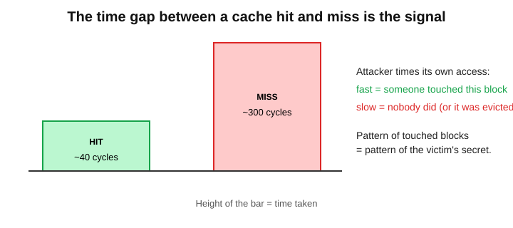

# Side Channels & Hardware Security — Explained Simply

> Based on **Deck 9 of µArch Lab**. Prior knowledge helpful: how caches work (hit vs miss) and speculation in out-of-order CPUs. See `README-caches-memory.md` first if needed.

**One-line summary:** *Every trick that makes a chip fast leaves a trace. Attackers read those traces to steal secrets, and designers must close the holes, paying some speed.*

---

## Table of Contents
1. [What a side channel is](#1-what-a-side-channel-is)
2. [Timing attacks](#2-timing-attacks)
3. [Cache-timing attacks](#3-cache-timing-attacks)
4. [Spectre and Meltdown](#4-spectre-and-meltdown)
5. [Physical channels](#5-physical-channels)
6. [Defences and their price](#6-defences-and-their-price)
7. [Check yourself](#7-check-yourself)
8. [Cheat sheet](#8-cheat-sheet)

---

## 1. What a side channel is

### The analogy
A safe-cracker doesn't know the combination. They press an ear to the door and **listen for the click** of each wheel. The lock's design is sound; its *behaviour* gives it away.

### The idea
Software runs on physical hardware that:
- takes **time**,
- draws **power**,
- gives off **electromagnetic radiation**,
- changes **shared internal state** (like caches).

If any of these depends on a secret, an observer can learn the secret.

> A **side channel** is an unintended signal (time, power, radiation, cache state) that leaks information the program never meant to reveal. The attacker doesn't break the cipher; they **watch the machine running it**.

### Side channel vs covert channel

| | Side channel | Covert channel |
|---|---|---|
| **Intent** | unintended; the victim leaks | deliberate; someone signals on purpose |
| **Parties** | unaware victim + attacker | two colluding programs |
| **Goal** | steal a secret | sneak data past an isolation rule |

Many attacks internally build a covert channel to carry a stolen value out.

### Two questions to ask about any attack
1. *What signal depends on the secret?*
2. *What must the attacker be able to measure?* Sharing the machine (cloud, browser, app) or **holding the device** (a smart card on a bench)?

---

## 2. Timing attacks

The simplest channel: **a stopwatch**.

### An early exit leaks

```c
// LEAKY: returns as soon as one byte differs
bool compare(const uint8_t *a, const uint8_t *b, size_t n) {
    for (size_t i = 0; i < n; i++)
        if (a[i] != b[i]) return false;    // stops early
    return true;
}
```

- A guess whose **first byte is right** takes slightly longer to reject than one with no right bytes.
- So the attacker tries all 256 values for byte 1, keeps the slowest, then moves to byte 2, and so on.
- For a 16-byte secret: about **16 × 256 = 4,096 tries** instead of **256¹⁶**. An impossible search becomes quick.

### The fix: constant-time code

```c
// CONSTANT TIME: looks at every byte, never branches on secrets
bool ct_equal(const uint8_t *a, const uint8_t *b, size_t n) {
    uint8_t diff = 0;
    for (size_t i = 0; i < n; i++)
        diff |= a[i] ^ b[i];      // collect differences, never stop early
    return diff == 0;
}
```

**Rules of constant-time code:**
- no branches that depend on secret data;
- no memory addresses computed from secrets (no `table[secret]`);
- no instructions whose speed depends on operands, when used on secrets.

*"Fast on average" is not a security property. The variation is the leak.*

---

## 3. Cache-timing attacks

The shared cache is a stopwatch **that remembers what the victim touched**.



- A hit takes a few cycles; a miss, hundreds. Easy to measure.
- If the victim's memory accesses depend on a secret, the blocks it leaves in a **shared** cache encode that secret.
- The attacker times *its own* accesses to read the pattern back. **No bug in the victim is needed.**

**Why it's hard to kill:** caches may change *speed* but never *results*, and timing is exactly what the instruction set leaves undefined. A shared cache is useful *because* it's shared; isolating it perfectly erases the benefit.

### Three classic techniques

| Technique | Needs shared memory? | How it works | Notes |
|---|---|---|---|
| **Flush+Reload** | Yes | Flush a line → victim runs → reload and time it. Fast = victim touched it | precise, low noise |
| **Prime+Probe** | No | Fill a cache set with your lines → victim runs → re-time your lines. Slow ones were evicted = victim used that set | works across virtual machines |
| **Evict+Time** | No | Time the whole victim → evict a chosen set → time again. Slower = victim depends on that set | coarse but simple |

### Flush+Reload, conceptually (safe model)
1. **Flush** the line from the cache.
2. Let the **victim run**.
3. **Reload** and time. *Fast?* The victim used it. *Slow?* It didn't.

---

## 4. Spectre and Meltdown

In 2018, **speculation itself** turned out to be a side-channel engine.

### The gap that leaks
- An out-of-order core runs ahead on **guesses**. Wrong-path instructions are thrown away: no register or memory change survives.
- But **the cache blocks they loaded stay in the cache**.
- Work done in that brief window before the squash is **transient execution**. Inside it, an attacker can (1) read a secret and (2) touch a cache block whose address depends on it.
- Then **Flush+Reload** reads the secret out of the cache.

> **Speculation deletes the result, but not the footprint.**

### Spectre, step by step (concept only)


1. **Train**: run a bounds check many times with valid input, so the predictor learns "in bounds".
2. **Mislead**: pass an out-of-bounds index; the predictor still guesses "in bounds".
3. **Transient read**: the core reads the secret and touches `probe[secret]`.
4. **Squash**: the check resolves, results are discarded, but the cache keeps the footprint.
5. **Time it**: Flush+Reload finds which probe line is fast, which reveals the secret.

The program's own trusted code is tricked into leaking.

### Spectre vs Meltdown

| | Spectre | Meltdown |
|---|---|---|
| **Root cause** | speculating past a mistrained branch | using a load's value before its permission fault takes effect |
| **Barrier bypassed** | a software bounds/type check | the user/kernel privilege boundary |
| **Reads** | the victim's own memory | kernel memory, from a user program |
| **Carried out by** | cache (Flush+Reload, Prime+Probe) | cache (Flush+Reload) |
| **Main fix** | speculation fences, retpolines, masked indices | unmapping the kernel (KPTI); fixed chips |

A whole family followed the same recipe: *find a transient window → make a secret-dependent access → carry it out through a microarchitectural channel.* Examples: Foreshadow, RIDL, ZombieLoad, Retbleed.

---

## 5. Physical channels

Hold the device, and **power, radiation and deliberate glitches** join the list.

### Power analysis
A chip's power draw depends on how many bits switch each cycle, which depends on the data. Measure the current (or radio waves) and you see the computation's outline.


- **SPA (Simple Power Analysis):** read the secret straight off **one** trace. In naive RSA, a `1` key bit causes an extra multiply, an extra bump.
- **DPA / CPA (Differential / Correlation):** use statistics over **thousands** of traces to pull a tiny leak out of noise.
- **Fix:** make the sequence of operations independent of the key (always multiply, then keep or discard the result).

### Fault injection (glitching)
Disturb the hardware on purpose: a dip in supply voltage, a too-short clock pulse, an electromagnetic pulse, a laser on the bare die.
- One well-timed glitch can **skip a single instruction**, such as the branch that checks a signature at boot.
- Or it **corrupts one step of a cipher**; comparing right and wrong outputs can reveal the key.
- **Defences:** checks done twice, glitch sensors, randomised timing, error-detecting arithmetic.
- Needs the device in hand, which is exactly what an attacker has with a card or IoT gadget.

### Almost any shared state can leak

| Channel | Shared thing | What leaks |
|---|---|---|
| **Branch predictor** | prediction tables | victim's branch directions; also how Spectre misleads |
| **TLB** | translation cache | which pages the victim uses |
| **Execution ports** | units shared by SMT threads | which instruction kinds the sibling thread runs |
| **DRAM rows** | physical memory cells | not a leak but a fault: **Rowhammer** |

**Rowhammer:** reading one DRAM row very rapidly disturbs neighbours and flips their bits, using only legal reads. It has been used to corrupt page tables. Defences: targeted refresh, error-correcting memory, guard rows.

---

## 6. Defences and their price

No single fix: **layers**, each paid for in performance.

| Defence | Who | Against | Price |
|---|---|---|---|
| Constant-time code | programmers | timing, cache timing | careful coding |
| Cache partitioning | hardware, OS | Prime+Probe, Flush+Reload | less cache per program |
| Flushing at switches | OS, hardware | leftover state | cold caches after every switch |
| Speculation fences | compiler, programmer | Spectre (bounds check) | stalls the pipeline |
| Retpolines, index masking | compiler | Spectre variants | slower indirect jumps |
| Kernel page-table isolation | OS | Meltdown | slower system calls |
| Masking and hiding | hardware, crypto | power/radiation analysis | area and power |
| SMT off for strangers | OS | port contention | half the threads |

### The big lesson: *the feature is the leak*
- Caches leak because they are **shared and fast on reuse**.
- Speculation leaks because it **runs ahead of correctness**.
- SMT leaks because threads **share units**.

Every microarchitectural side channel traces back to a **performance optimisation**. Security can't be bolted on afterwards: isolation, constant-time behaviour, and the option to turn sharing off must be designed in. A chip that never speculated and shared nothing would be free of these channels, but perhaps **5–10× slower**. The art is giving up the *least* speed needed to close a given channel.

> ⚠️ **Misconception:** *"If the maths is secure, the chip is secure."* Security proofs assume a machine that reveals only inputs and outputs. Real silicon also reveals time, power and shared state. AES-256 is unbroken, yet table-based AES has leaked keys through the cache.

---

## 7. Check yourself

1. Why does `if (secret_bit) x = slow(); else x = fast();` leak, even though `x` is never printed?
2. After a wrong guess is squashed, what survives that Spectre relies on?

<details>
<summary>Answers</summary>

1. The running time depends on the secret bit; anyone who can time the code learns it.
2. The **cache state**: blocks loaded by transient instructions stay cached, and their timing can be measured.
</details>

---

## 8. Cheat sheet

- **Side channel** = secrets leaking via time, power, radiation, cache state, not via the algorithm.
- **Constant-time code**: no secret-dependent branches, addresses, or variable-speed instructions.
- **Flush+Reload / Prime+Probe / Evict+Time** read a victim's access pattern from a shared cache.
- **Spectre / Meltdown** use transient execution: squashed work leaves a cache footprint.
- **Power analysis, fault injection, predictors, TLBs, Rowhammer** widen the field.
- Every defence costs speed. **The feature is the leak.**
