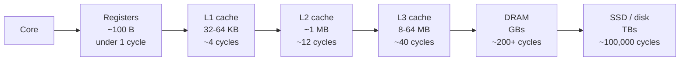
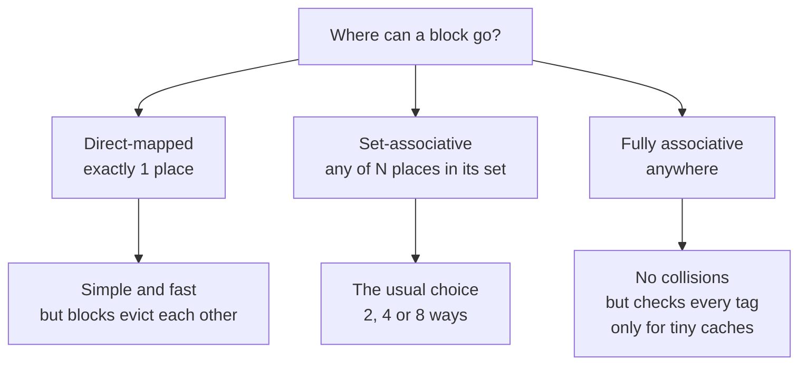
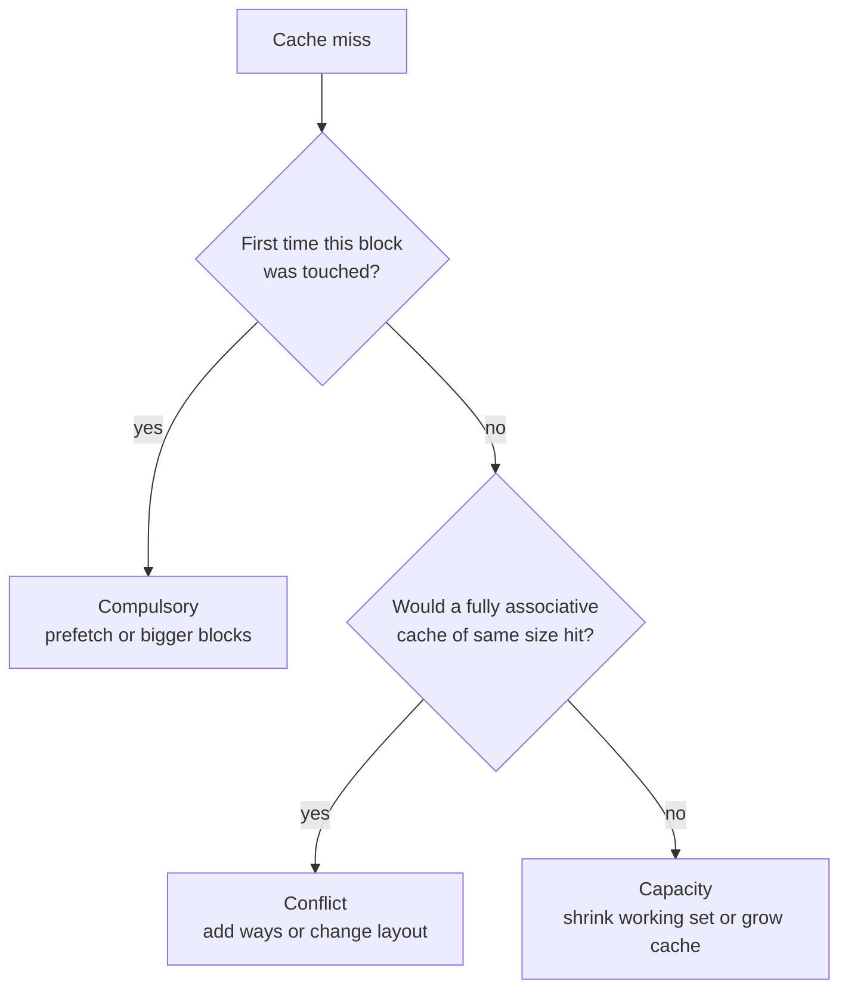
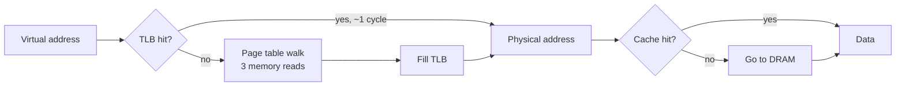
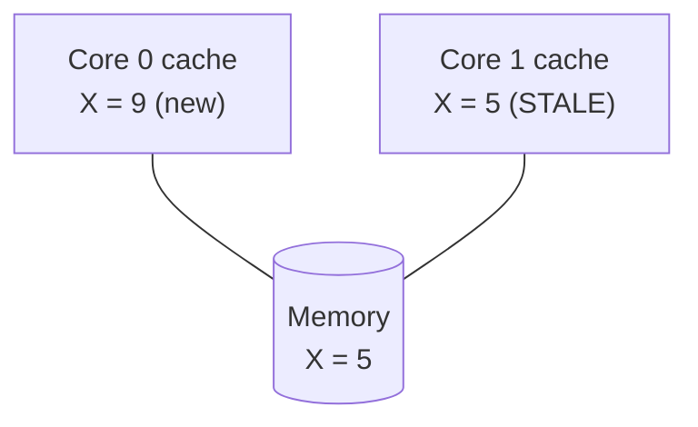
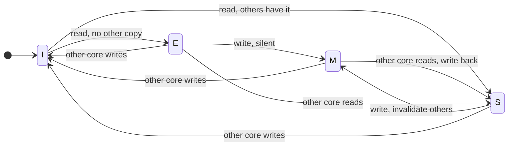
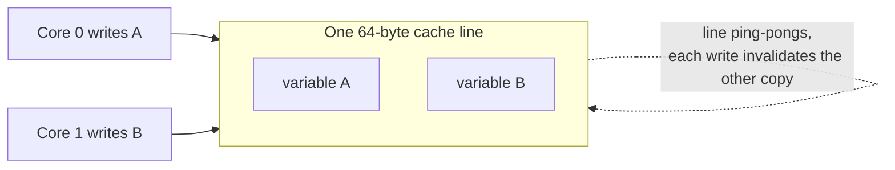
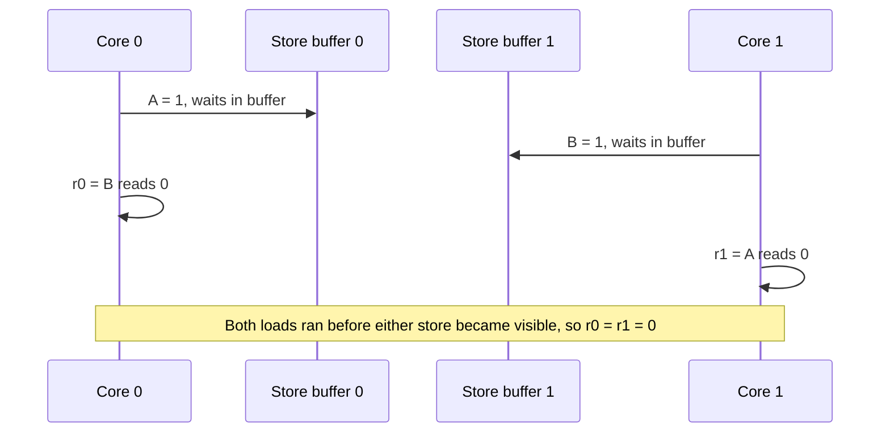
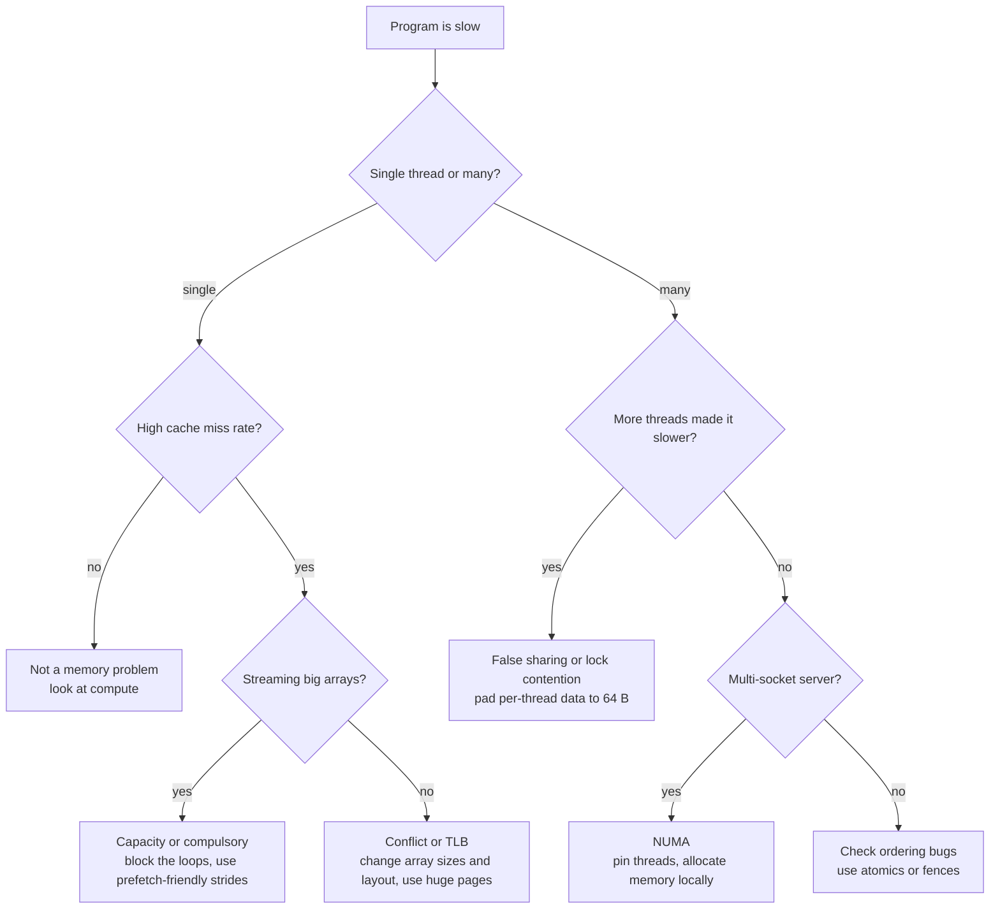

# Caches & Coherence: A Visual Guide to the Memory System

How a processor hides slow memory behind small, fast copies, and how many cores keep those copies in agreement.

Based on *µArch Lab, Deck 4: Caches & Coherence*. Every section ends with **Where to use it**, so you know when the idea matters in real work.

> All diagrams are [Mermaid](https://mermaid.js.org/) and render natively on GitHub.

---

## Table of Contents

1. [The memory hierarchy](#1-the-memory-hierarchy)
2. [How a cache finds data](#2-how-a-cache-finds-data)
3. [Why misses happen](#3-why-misses-happen)
4. [Average memory access time (AMAT)](#4-average-memory-access-time-amat)
5. [Writes and helper tricks](#5-writes-and-helper-tricks)
6. [Virtual memory and the TLB](#6-virtual-memory-and-the-tlb)
7. [Coherence: many cores, one truth](#7-coherence-many-cores-one-truth)
8. [Consistency: the order of everything](#8-consistency-the-order-of-everything)
9. [Where do I use this? (decision guide)](#9-where-do-i-use-this)
10. [Check yourself](#10-check-yourself)
11. [Cheat sheet](#11-cheat-sheet)

---

## 1. The memory hierarchy

Fast memory is small and costly. Big memory is slow and cheap. So we stack them: the top is fast, the bottom is big.

A **cache** keeps copies of recently used data close to the processor.

- **Cache hit**: the data is there.
- **Cache miss**: it is not, and the request goes one level down.

Caches never change a program's answer. They only change how long it takes.



| Level | Size | Time |
|---|---|---|
| Registers | ~100 B | < 1 cycle |
| L1 | 32-64 KB | ~4 cycles |
| L2 | ~1 MB | ~12 cycles |
| L3 | 8-64 MB | ~40 cycles |
| DRAM | GBs | ~200+ cycles |
| SSD | TBs | ~100,000 cycles |

### Why it works: locality

| Type | Idea | Example | Cache response |
|---|---|---|---|
| **Temporal** | Data used now will likely be used again soon | Loop counter, top of stack | Keep recently used data |
| **Spatial** | If address A is used, nearby addresses will be too | Walking an array, running instructions in order | Fetch a whole neighbourhood, a **cache line** (typically 64 bytes) |

**Analogy:** a student keeps the three books in use open on the desk, a dozen on the shelf, the rest in the city library. Nearly every look-up hits the desk.

**Where to use it:** write code that reuses data and walks memory in order. Caches only help programs that have locality.

---

## 2. How a cache finds data

Every address is cut into three pieces.

```
 high bits                                              low bits
+----------------------------+---------------+------------------+
|            TAG             |     INDEX     |      OFFSET      |
+----------------------------+---------------+------------------+
 "which of the many blocks     "which set      "which byte inside
  that could live here is       (row) do I      the block?"
  this one?"                    look in?"
```

- **Offset** picks the byte in a block. 64-byte blocks need 6 offset bits.
- **Index** picks the set to look in.
- **Tag** is the rest. It is stored with the block and compared to confirm it is the right one.

### Where may a block live?



| Design | Places per block | Pros | Cons |
|---|---|---|---|
| Direct-mapped | 1 | Simple, fast | Conflicts: two busy blocks ping-pong |
| Set-associative (N-way) | N | Good compromise | More tags to compare |
| Fully associative | Any | No conflicts | Checks every tag on each access |

When a set is full, one block is evicted. The usual rule is **LRU** (least recently used).

**Analogy:** car parking. An assigned bay is direct-mapped. Any bay on your floor is set-associative. Any bay in the building is fully associative.

**Where to use it:** associativity is the design knob that removes conflict misses. In software, arrays whose size is a large power of two (like 4096 floats) can map to the same sets and thrash a low-associativity cache.

---

## 3. Why misses happen

Three causes, each with its own cure. Multicore adds a fourth, the coherence miss ([section 7](#7-coherence-many-cores-one-truth)).

| Miss | Cause | Cure |
|---|---|---|
| **Compulsory** (cold) | First touch of a block, never cached | Bigger blocks, prefetching |
| **Capacity** | Working data does not fit | Bigger cache |
| **Conflict** | Too many busy blocks map to one set though the cache has room elsewhere | More associativity |

A conflict miss is one that a fully associative cache of the same size would have avoided.



### Every knob has a price

| Turn up | Compulsory | Capacity | Conflict | Price |
|---|---|---|---|---|
| **Cache size** | - | fewer | fewer | Slower hits, more area and power |
| **Associativity** | - | - | many fewer | Slower hits (more tags to compare) |
| **Block size** | fewer | can rise | can rise | Each miss fetches more bytes |

Block size has a sweet spot: too small wastes spatial locality, too big drags in unused bytes. **64 bytes** is near-universal.

Rule of thumb: a direct-mapped cache of size N misses about as often as a 2-way cache of size N/2.

### Worked cases

- **Array, twice:** the first pass misses on every block; the second pass hits every time. With 8-byte blocks, spatial locality halves the misses.
- **Ping-pong:** addresses 0 and 16 land in the same set of a direct-mapped cache and evict each other every time. In a 2-way cache, after the first two misses, all hits.
- **Too much data:** five blocks cycle through a four-block cache. With LRU, even full associativity misses every time, because each block is evicted just before it is needed again. Only a bigger cache helps.

**Where to use it:** profile first (for example `perf stat`). The flowchart tells you whether to change the data layout, the loop, or the hardware.

---

## 4. Average memory access time (AMAT)

One formula judges any cache design.

```
AMAT = hit time + miss rate x miss penalty
```

**One level.** L1 hit = 1 cycle, miss rate = 4%, DRAM = 200 cycles:

```
AMAT = 1 + 0.04 x 200 = 1 + 8 = 9 cycles
```

The 4% of accesses that miss cost eight times more than the 96% that hit.

**Several levels.** The penalty of a level is the AMAT of the next one:

```
AMAT = hitL1 + missL1 x (hitL2 + missL2 x (hitL3 + missL3 x DRAM))
```

Example: L1 (hit 1, miss 5%), L2 (hit 12, miss 40%), L3 (hit 40, miss 50%), DRAM 200:

```
L3 level:  40 + 0.50 x 200 = 140
L2 level:  12 + 0.40 x 140 =  68
L1 level:   1 + 0.05 x  68 = 4.4 cycles
```

4.4 cycles instead of 9.

> **Common mistake:** the miss rates must be **local** (misses at that level divided by accesses *reaching* that level). Mixing local and global rates gives wrong answers.

### How the levels are arranged

| Choice | Meaning |
|---|---|
| **L1 split** | Separate instruction and data caches, so fetching and loading never compete |
| **L2 / L3 unified** | One pool for instructions and data |
| **Private and shared** | Each core has its own L1 and L2; all cores share the last level |
| **Inclusive** | Lower level keeps a copy of everything in L1 (simpler bookkeeping) |
| **Exclusive** | Each block lives in one level only (more total capacity) |

**Where to use it:** design reviews and exams, to compare "bigger L1 with slower hits" against "add an L2" using one number.

---

## 5. Writes and helper tricks

### Write policies

| Policy | On a store | Pros | Cons |
|---|---|---|---|
| **Write-through** | Update cache **and** the next level | Simple, always up to date | Lots of traffic |
| **Write-back** | Update only the cache, mark block **dirty**, write down on eviction | Far less traffic | More complex. The norm. |

- On a store **miss**: *write-allocate* fetches the block first (usual with write-back). *No-write-allocate* writes straight through (usual with write-through).
- A **write buffer** holds finished stores so the core need not wait for them to reach memory.

### Three helpers

| Helper | What it does |
|---|---|
| **Victim cache** | Tiny fully associative store of recently evicted blocks. Catches conflict misses cheaply. |
| **Prefetching** | Fetches blocks before they are asked for. Hardware spots patterns like "every 64 bytes". Too eager pollutes the cache. |
| **Non-blocking cache** | Keeps serving hits while misses are pending and tracks several misses at once. Essential for out-of-order cores. |

**Where to use it:** streaming through large arrays works well because hardware prefetchers love constant strides. Random pointer chasing (linked lists) defeats them.

---

## 6. Virtual memory and the TLB

With **virtual memory**, programs use *virtual* addresses and hardware translates each to a *physical* address.

- Translation works in **pages**, commonly 4 KiB.
- A **page table** in memory records where each virtual page really lives.
- Benefits: isolation (programs cannot see each other), freedom of placement, and the ability to keep rarely used pages on disk.

**Analogy:** flat numbers in two buildings. "Flat 1" exists in both; the postal service knows which street each is on.

Page tables are big, so they are multi-level. RISC-V Sv39 uses three levels: a full walk is **three extra memory reads** per access, far too slow. The **TLB** (translation lookaside buffer) is a small, fast cache of recent translations.



**Design trick:** L1 can be looked up *while* the TLB translates, using address bits that translation does not change. That is one reason many L1 caches are **32 KiB, 8-way**: 32 KiB / 8 = 4 KiB, exactly one page.

**Where to use it:** large working sets thrash the TLB. Databases and ML jobs enable **huge pages** (2 MiB) so one TLB entry covers far more memory.

---

## 7. Coherence: many cores, one truth

Give every core its own cache and copies of the same data can disagree.



Both cores cached X = 5. Core 0 writes 9 into its own cache. Core 1 still reads 5.

**Cache coherence** is the hardware guarantee that, for each memory location, all cores see the latest write, and see writes to it in the same order.

### Two ways to keep watch

| | Snooping | Directory |
|---|---|---|
| How | Every cache listens to shared wires. A write is announced to all. | A central record notes which cores hold each block. Messages go only to them. |
| Strength | Simple and quick | Scales to many cores and chips |
| Weakness | Does not scale beyond about a dozen cores | Costs storage for the directory |
| Analogy | Shouting across an open-plan office | A receptionist who knows whom to phone |

### The MESI protocol: four states per cache line

| State | Meaning | Matches memory? | Others may hold it? |
|---|---|---|---|
| **M**odified | Only copy, and it has been changed | No, memory is stale | No |
| **E**xclusive | Only copy, unchanged | Yes | No |
| **S**hared | Read-only copy; others may have one | Yes | Yes |
| **I**nvalid | No usable copy | - | - |

The rule behind it: **many readers, or one writer, never both.** To write, a core must first make every other copy Invalid.

**E** improves on the older MSI protocol: a core that reads data nobody else has can later write it with no announcement, the common case for private data.



**Trace to try:** Core 0 reads, then Core 1 reads, then Core 1 writes, then Core 0 reads.

| Step | Core 0 | Core 1 | Memory |
|---|---|---|---|
| Core 0 reads X | E | I | current |
| Core 1 reads X | S | S | current |
| Core 1 writes X | I | M | **stale** |
| Core 0 reads X | S | S | updated (write-back) |

### A trap: false sharing

Coherence works on whole **64-byte blocks**, not single variables.



If core 0 keeps updating A and core 1 keeps updating B, and both sit in the same block, every write invalidates the other core's copy. No data is truly shared, yet cores slow each other down, sometimes **10x or more**.

**Fix:** put such variables in separate blocks.

```cpp
// C++: give each thread's counter its own cache line
struct alignas(64) Counter { long n; };
Counter counts[NUM_THREADS];
```

**Where to use it:** per-thread counters, work queues, locks and spinlocks in any multithreaded program. Check for false sharing whenever adding threads makes code *slower*.

---

## 8. Consistency: the order of everything

Coherence covers **one location**. A **memory consistency model** states which orders of reads and writes to *different* locations other cores may observe.

| Model | The rule | Used by |
|---|---|---|
| **Sequential consistency** | As if all cores took turns, each in its own program order. Intuitive, but forbids many speed tricks. | No mainstream fast CPU |
| **TSO** (total store order) | A load may overtake an earlier store to a different address (stores wait in a buffer). Nothing else reorders. | x86, SPARC |
| **Weak / relaxed** | Almost any independent pair may be reordered. | Arm, RISC-V (RVWMO), Power |

### When order matters

Two cores, flags A and B both start at 0:

```
Core 0        Core 1
A = 1         B = 1
r0 = B        r1 = A
```

- With sequential consistency, at least one of `r0`, `r1` must be 1.
- With store buffers (TSO), both stores can still be waiting when the loads run, so `r0 = r1 = 0` is possible.



A **fence** (memory barrier) forces earlier memory operations to complete before later ones start.

| Architecture | Fence |
|---|---|
| x86 | `MFENCE` |
| Arm | `DMB` |
| RISC-V | `FENCE rw,rw` |

Languages wrap this in atomics, so programmers rarely write fences by hand, but locks and flags rely on them.

> **Misconception:** "Coherence and consistency are the same thing."
> Coherence makes caches agree about each location. Consistency governs the order across locations. A perfectly coherent machine can still show writes to X and Y out of order. Fences fix ordering; they do not "make caches coherent", because they already are.

### Scaling up: NUMA and the roofline

- **NUMA:** in big servers each chip owns part of the memory. Its own part is fast; another chip's part is slower. Good software places data near the core that uses it.
- **Roofline:** plot speed against "calculations per byte fetched". Programs that do little work per byte hit the slanted **memory roof**; those that do a lot hit the flat **compute roof**. It is the memory wall, drawn as a line.

**Where to use it:** writing locks, flags or lock-free structures. In practice use language atomics (`std::atomic`, Java `volatile`, Rust atomics), which insert the right fences for each CPU.

---

## 9. Where do I use this?

Start from the symptom.



| Role | Concepts you will use |
|---|---|
| **Software / performance engineer** | Locality, loop blocking, struct layout, false sharing, NUMA, huge pages, atomics |
| **CPU / SoC designer** | Cache size, associativity, block size, write policy, MESI or directory, TLB, AMAT |
| **OS / systems developer** | Page tables, TLB shootdowns, memory-ordering fences |
| **Student** | Tag/index/offset arithmetic, the three Cs, AMAT, MESI traces |

### Quick wins in code

```c
// Good: row-major walk, uses every byte of each cache line
for (int i = 0; i < N; i++)
    for (int j = 0; j < N; j++)
        sum += a[i][j];

// Bad: column walk, strides by a full row, misses far more often
for (int j = 0; j < N; j++)
    for (int i = 0; i < N; i++)
        sum += a[i][j];
```

---

## 10. Check yourself

<details>
<summary><b>1.</b> L1 hit = 2 cycles, miss rate 10%, penalty 100 cycles. What is AMAT?</summary>

2 + 0.10 x 100 = **12 cycles**.
</details>

<details>
<summary><b>2.</b> Two blocks keep evicting each other in a direct-mapped cache that is mostly empty. Which kind of miss, and what fixes it?</summary>

**Conflict misses.** More associativity; 2-way would do.
</details>

<details>
<summary><b>3.</b> Core 2 holds X in state M. Core 0 reads X. What happens?</summary>

Core 2 supplies the data and writes it back to memory. Both copies end up **Shared (S)**.
</details>

<details>
<summary><b>4.</b> Does a fence make caches coherent?</summary>

No. Caches are already coherent. A fence only enforces order across different locations.
</details>

---

## 11. Cheat sheet

| Topic | Remember |
|---|---|
| Locality | Temporal = reuse soon. Spatial = use neighbours. Line = 64 B. |
| Address | tag / index / offset |
| Placement | Direct-mapped, set-associative (usual), fully associative |
| Misses | Compulsory, capacity, conflict (+ coherence on multicore) |
| AMAT | hit time + miss rate x miss penalty, local rates, level by level |
| Writes | Write-back + write-allocate is the norm |
| TLB | Cache for address translations; miss = page-table walk |
| MESI | Modified, Exclusive, Shared, Invalid. Many readers or one writer. |
| False sharing | Different variables, same 64 B line. Pad them apart. |
| Consistency | Order across locations. TSO = x86. Weak = Arm / RISC-V. Fences enforce order. |

---

## Recap

- Caches exploit temporal and spatial locality; data moves in 64-byte lines.
- An address splits into tag, index and offset. Direct-mapped, set-associative and fully associative caches trade speed against collisions; LRU picks the victim.
- Misses are compulsory, capacity or conflict. AMAT applies level by level.
- Write-back caches, prefetching and non-blocking caches keep a fast core fed. Virtual memory translates pages; the TLB caches translations.
- Coherence (MESI) keeps copies of one location in agreement; consistency models and fences govern order across locations.

**Next topic:** the on-chip interconnect, the roads that carry requests between cores, caches, memory and devices.

---

*Source material: µArch Lab, Microarchitecture & SoC design, Deck 4 of 11.*
