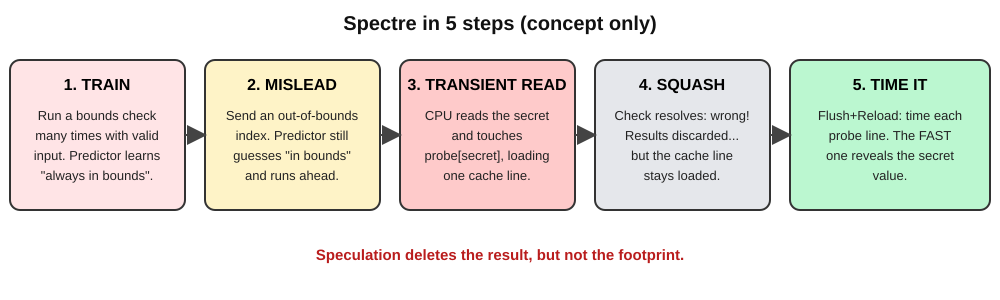
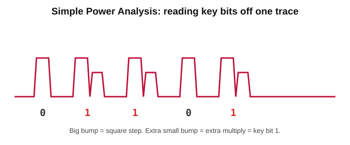

# Side Channels & Hardware Security 

---

## Table of Contents
1. [What a side channel is](#1-what-a-side-channel-is)
2. [Timing attacks](#2-timing-attacks)
3. [Cache-timing attacks](#3-cache-timing-attacks)
4. [Spectre and Meltdown](#4-spectre-and-meltdown)
5. [Physical channels](#5-physical-channels)
6. [Defences and their price](#6-defences-and-their-price)


---

## 1. What a side channel is


A **side channel** is an unintended way a computer can leak information through its behaviour.

### Simple Analogy

Imagine a safe with a secret combination.

An attacker does not break the safe. Instead, they **listen to the clicks** while someone enters the combination.

The clicks give information about the secret.

A computer can behave in a similar way.

### Common Side Channels

A computer can leak information through:

- **Time** → Different operations may take different amounts of time.
- **Power** → Different operations may use different amounts of power.
- **Electromagnetic radiation** → Hardware can produce measurable signals.
- **Cache state** → Operations can change what is stored in the cache.

```text
Secret
   ↓
Computer operation
   ↓
Changes machine behaviour
   ↓
Attacker measures the behaviour
   ↓
Secret information is inferred
```

> **A side channel is an unintended signal from a computer that can reveal information about a secret.**

> 

The attacker does not necessarily break the encryption itself. Instead, they **observe how the machine behaves** and use that information to infer the secret.

---
**A covert channel is a hidden communication method where two programs intentionally use a shared resource, such as a cache, to secretly send information to each other.**

### Side Channel vs Covert Channel

| | **Side Channel** | **Covert Channel** |
|---|---|---|
| **Intent** | Unintended information leakage | Intentional communication |
| **Parties** | Victim + attacker | Two cooperating programs |
| **Purpose** | Learn a secret | Secretly communicate |

Example:

```text
Side Channel:
Victim → changes cache → Attacker observes cache

Covert Channel:
Program A → changes cache → Program B observes cache
```


---

## 2. Timing attacks


A **timing attack** is a side-channel attack where an attacker measures **how long a program takes to perform an operation** and uses the timing difference to learn secret information.

### Simple Example

Suppose a program compares a secret password:

```c
bool compare(const uint8_t *a, const uint8_t *b, size_t n) {
    for (size_t i = 0; i < n; i++)
        if (a[i] != b[i])
            return false;   // Stops early

    return true;
}
```

If the first byte is correct, the program checks one more byte and takes slightly longer.

```text
Wrong first byte
→ Stops immediately
→ Shorter time

Correct first byte
→ Checks next byte
→ Slightly longer time
```

An attacker can try all **256 possible values** for the first byte and choose the one that takes the longest time. Then they repeat the process for the next byte.

For a 16-byte secret:

```text
16 × 256 = 4,096 attempts
```

instead of trying:

```text
256¹⁶ combinations
```

This makes the attack much easier.

### The Fix: Constant-Time Code

The program should always perform the same amount of work, regardless of the secret.

```c
bool ct_equal(const uint8_t *a, const uint8_t *b, size_t n) {
    uint8_t diff = 0;

    for (size_t i = 0; i < n; i++)
        diff |= a[i] ^ b[i];

    return diff == 0;
}
```

Here, the program checks **every byte** and does not stop early.

### Rules of Constant-Time Code

- Avoid branches that depend on secret data.
- Avoid memory accesses such as `table[secret]`.
- Avoid instructions whose execution time depends on secret values.

> **Timing attack = Measure time to learn a secret.**

> **Constant-time code = Make secret-dependent operations take predictable time.**

**Important:** Fast code is not necessarily secure. **Timing variation can leak information.**

---

## 3. Cache-timing attacks


The shared cache acts like a **stopwatch that remembers what the victim accessed**.

- A **cache hit** takes a few cycles.
- A **cache miss** takes much longer.
- If the victim's memory accesses depend on a secret, the cache state can reveal information about that secret.
- The attacker times its **own cache accesses** to detect the pattern.

> **Cache-timing attack = Measure cache access time to learn information about a secret.**

### Three Classic Techniques

| **Technique** | **Shared Memory?** | **How It Works** |
|---|---|---|
| **Flush+Reload** | Yes | Flush a cache line → victim runs → reload and time it. Fast = victim used it. |
| **Prime+Probe** | No | Fill a cache set → victim runs → re-time your lines. Slow = victim evicted them. |
| **Evict+Time** | No | Evict a chosen cache set → run the victim → compare execution times. |

### Flush+Reload

Conceptually:

```text
1. Flush the cache line
        ↓
2. Let the victim run
        ↓
3. Reload and measure
        ↓
Fast → Victim used the line
Slow → Victim did not use it
```
---

## 4. Spectre and Meltdown



### What Are Spectre and Meltdown?

**Spectre** and **Meltdown** are CPU security vulnerabilities discovered in 2018.

They take advantage of a feature called **speculative execution**.

Modern CPUs try to work faster by **guessing what instructions will be needed next** and executing them before they are completely sure.

If the guess is wrong, the CPU removes the results.

But there is a problem:

> **The result is removed, but some changes inside the CPU, such as cache changes, can remain.**

An attacker can measure these changes and use them to learn secret information.

---

### What Is Speculative Execution?

Suppose the CPU reaches:

```text
if (condition)
    do A
else
    do B
```

The CPU may not want to wait for the condition to be known.

So it **guesses** which path will be taken and starts executing it.

```text
CPU
 ↓
Make a prediction
 ↓
Execute instructions early
 ↓
Prediction correct?
 ├── Yes → Keep the work
 └── No  → Discard the results
```

This makes the CPU faster.

---

### The Problem

Even when the CPU makes a wrong prediction:

```text
Wrong prediction
      ↓
CPU executes instructions
      ↓
Secret may be accessed
      ↓
Secret changes the cache
      ↓
CPU discovers the mistake
      ↓
Results are discarded
      ↓
Cache change remains
```

The attacker can then measure the cache.

> **Speculation deletes the result, but not the footprint.**

---

# Spectre

**Spectre** tricks the CPU into **speculatively executing the wrong path**.

### Spectre in 5 Steps

```text
1. TRAIN
      ↓
2. MISLEAD
      ↓
3. TRANSIENT READ
      ↓
4. SQUASH
      ↓
5. TIME IT
```

### 1. Train

The attacker repeatedly gives normal inputs.

The CPU learns:

> "This condition is usually true."

The branch predictor becomes trained to expect that path.

### 2. Mislead

The attacker suddenly gives an input that should fail the check.

But the CPU still predicts:

> "The check will pass."

So it starts executing instructions speculatively.

### 3. Transient Read

During this short period, the CPU may access secret data.

The secret is then used to access a particular cache location.

```text
Secret value
     ↓
Choose cache location
     ↓
Cache line becomes loaded
```

### 4. Squash

The CPU finally discovers that its prediction was wrong.

It removes the speculative results.

But:

```text
Registers/results → Removed
Cache change      → Remains
```

### 5. Time It

The attacker measures different cache locations.

```text
Fast access  → Was probably loaded
Slow access  → Was probably not loaded
```

From this timing difference, the attacker can infer the secret.

> **Spectre = Trick the CPU's prediction and use the cache to reveal information.**

---

# Meltdown

**Meltdown** is different from Spectre.

It takes advantage of the CPU temporarily using data **before a permission check has completely stopped the operation**.

For example:

```text
User program
     ↓
Tries to access protected kernel memory
     ↓
CPU temporarily obtains the data
     ↓
Permission check fails
     ↓
CPU discards the result
     ↓
Cache footprint remains
     ↓
Attacker measures the cache
```

The important idea is:

> **The CPU eventually rejects the illegal access, but the temporary work can leave a cache footprint.**

Meltdown was especially important because it could allow a user-level program to infer information from **kernel memory** on affected CPUs.

---

# Spectre vs Meltdown

| | **Spectre** | **Meltdown** |
|---|---|---|
| Main idea | Tricks CPU speculation | Exploits temporary execution before a permission fault |
| Main target | Victim's memory | Protected/kernel memory |
| Uses cache? | Yes | Yes |
| Main attack | Train the branch predictor | Trigger an illegal/protected access |
| Main defense | Speculation barriers and safer code | KPTI and hardware fixes |

### Easy Difference

> **Spectre = Trick the prediction.**

> **Meltdown = Break the isolation temporarily.**

---

# The Common Attack Pattern

Both attacks can follow this general pattern:

```text
CPU executes something temporarily
             ↓
Secret information is accessed
             ↓
Secret affects the cache
             ↓
Attacker measures the cache
             ↓
Secret is inferred
```

This is why **cache-timing attacks** are important when studying Spectre and Meltdown.


> **The CPU may forget the wrong result, but the cache can remember what happened.**
---

## 5. Physical channels


Some side-channel attacks require **physical access to the device**.

An attacker can observe or disturb the device using:

- **Power consumption**
- **Electromagnetic radiation**
- **Fault injection**

---

### Power Analysis

A CPU uses slightly different amounts of power depending on the operations and data it is processing.

By measuring the device's power consumption, an attacker can sometimes learn information about a secret key.



### SPA — Simple Power Analysis

**SPA** looks at a single power trace.

For example, in a simple encryption algorithm:

```text
Key bit = 0 → normal operation
Key bit = 1 → extra operation
```

The extra operation creates an extra bump in the power trace.

```text
Small bump  → 0
Large/extra bump → 1
```

> **SPA = Read information directly from one power trace.**

### DPA / CPA

Sometimes the power difference is very small and hidden by noise.

**DPA (Differential Power Analysis)** and **CPA (Correlation Power Analysis)** use many power traces and statistics to find the small pattern.

```text
One trace
   ↓
Too much noise

Thousands of traces
   ↓
Statistical analysis
   ↓
Secret information
```

> **SPA = One trace**  
> **DPA/CPA = Many traces + statistics**

### Defense

The goal is to make the operations performed **independent of the secret key**.

For example:

```text
Always perform the same operations
        ↓
Do not change operations based on key bits
        ↓
Power pattern becomes harder to analyze
```

---

## Fault Injection

**Fault injection** means deliberately disturbing a device while it is running.

An attacker may use:

- Voltage glitches
- Clock glitches
- Electromagnetic pulses
- Lasers

For example:

```text
Normal:

Check signature
      ↓
Valid?
      ↓
Continue


With a fault:

Check signature
      ↓
Glitch!
      ↓
Check is skipped
      ↓
Continue
```

A carefully timed glitch may cause the CPU to **skip an instruction** or produce an incorrect result.

### Defenses

Common defenses include:

- Performing important checks twice
- Glitch detection
- Randomizing timing
- Error-detecting calculations

> **Fault injection = Deliberately disturb the hardware to make it behave incorrectly.**

---

## Almost Any Shared Hardware State Can Leak

| **Channel** | **Shared Resource** | **What Can Leak?** |
|---|---|---|
| **Branch Predictor** | Prediction tables | Which branches the victim takes |
| **TLB** | Address-translation cache | Which memory pages the victim uses |
| **Execution Ports** | CPU execution units shared by threads | Types of operations being executed |
| **DRAM Rows** | Physical memory cells | Can cause faults such as Rowhammer |

---

## Rowhammer

**Rowhammer** is a hardware fault attack on DRAM.

Repeatedly accessing certain DRAM rows can disturb nearby rows and cause their bits to **flip**.

```text
Row A → repeatedly accessed
        ↓
Disturbs nearby rows
        ↓
Bits in another row may flip
```

The attacker does not need to directly write to the affected memory.

Rowhammer has been used to corrupt important data such as **page tables**.

### Defenses

- Targeted DRAM refresh
- Error-correcting memory (ECC)
- Memory isolation and protection techniques

> **Rowhammer = Repeatedly access DRAM rows → disturb nearby cells → bits may flip.**

---


---

## 6. Defences and their price

There is **no single solution** that stops every side-channel attack.

Security usually uses **multiple layers of defenses**, but each defense can reduce performance or increase hardware/software cost.

| **Defense** | **Who Implements It?** | **Protects Against** | **Cost** |
|---|---|---|---|
| **Constant-time code** | Programmers | Timing and cache-timing attacks | More careful coding |
| **Cache partitioning** | Hardware / OS | Cache attacks such as Prime+Probe | Less cache available per program |
| **Cache flushing** | OS / Hardware | Leftover cache state | Caches become cold after switching |
| **Speculation fences** | Compiler / Programmer | Spectre | Can slow the CPU pipeline |
| **Retpolines / Index masking** | Compiler / Programmer | Spectre variants | Can reduce performance |
| **Kernel page-table isolation (KPTI)** | OS | Meltdown | Can add system-call overhead |
| **Masking / Hiding** | Hardware / Cryptography | Power and electromagnetic attacks | Extra area and power |
| **Disable SMT for untrusted threads** | OS | Shared execution-unit attacks | Fewer CPU threads available |

---

## Why Are Side Channels Difficult to Stop?

The main problem is that many side channels come from **features designed to make CPUs faster**.

### Cache

Caches are fast because they **remember recently used data**.

```text
Fast reuse
   ↓
Cache
   ↓
But timing reveals whether data is cached
```

> **The cache is useful because it is shared and fast — the same property can create a side channel.**

### Speculation

Speculation improves performance by allowing the CPU to **work ahead before it knows exactly what will happen**.

```text
CPU predicts
    ↓
Executes early
    ↓
Prediction may be wrong
    ↓
Results discarded
    ↓
Microarchitectural footprint may remain
```

> **Speculation improves speed but can leave information behind.**

### SMT

With **Simultaneous Multithreading (SMT)**, multiple threads share parts of the same CPU.

```text
Thread A ─┐
          ├── Shared CPU resources
Thread B ─┘
```

One thread may observe changes caused by another thread.

> **Sharing improves CPU utilization but can create information leaks.**

---

## The Big Lesson

Many microarchitectural side channels come from **performance optimizations**:

```text
Performance Optimization
        ↓
Sharing / Caching / Speculation
        ↓
Better Performance
        ↓
Possible Information Leak
```

Therefore, security cannot always be added afterward.

The system may need:

- **Isolation**
- **Constant-time code**
- **Controlled sharing**
- **Speculation barriers**
- **The ability to disable certain features when necessary**

> **Security is often a trade-off between performance and isolation.**

---

## Important Misconception

> ❌ **"If the mathematics is secure, the computer is secure."**

Cryptographic algorithms can be mathematically secure while their **implementation leaks information through the hardware**.

For example, an encryption algorithm may be secure mathematically, but a poorly designed implementation can reveal information through:

```text
Timing
Cache state
Power consumption
Electromagnetic radiation
```

So we must consider both:

```text
Secure Algorithm
       +
Secure Implementation
       +
Secure Hardware
       ↓
Better Overall Security
```

> **The algorithm may be secure, but the way the computer executes it can still leak secrets.**
```
